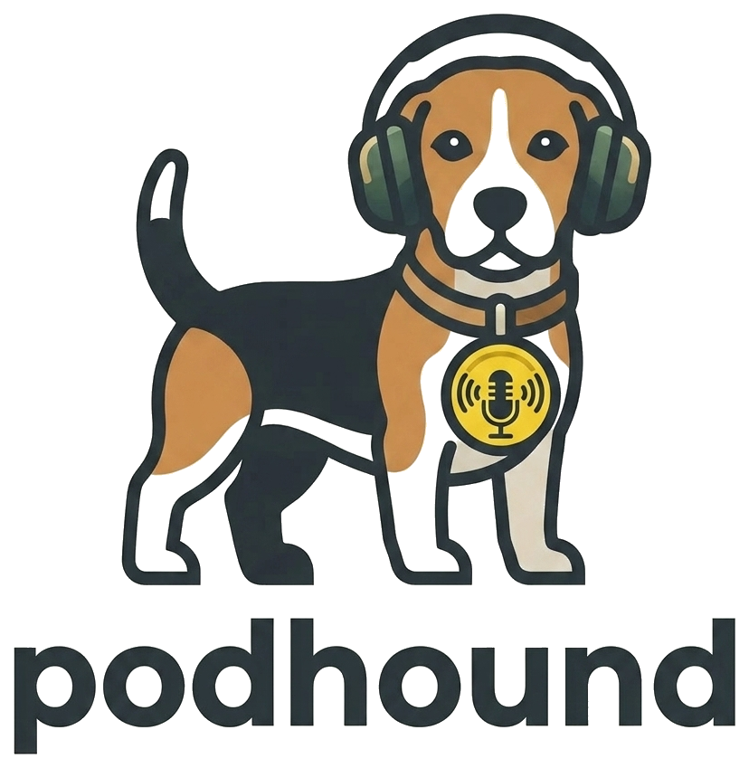

# 🐾 Podhound

[](LICENSE)
[](https://bun.sh)
[](https://www.typescriptlang.org/)

<table>
  <tr>
    <td valign="middle">
      <p><b>A lightweight, self-hosted podcast sync server.</b></p>
      <p>It doggedly tracks your subscriptions and playback progress, so you can seamlessly pick up right where you left off on any device.</p>
    </td>
    <td width="120" align="center" valign="middle">
      
    </td>
  </tr>
</table>

---

## 🛠️ Tech Stack

* **Runtime & Package Manager:** [Bun](https://bun.sh/) (TypeScript v7) — instant startup with zero compilation delay.
* **Database:** SQLite powered by the native high-performance `bun:sqlite` module (with `PRAGMA journal_mode = WAL` and `foreign_keys` enabled).
* **API Protocol:** [gPodder API v2](https://gpoddernet.readthedocs.io/en/latest/api/2/index.html) — full compatibility with mobile clients like **AntennaPod**, gPodder Desktop, etc.
* **Build / Compiling:** `bun build --compile` — compiles into **1 single standalone binary** with embedded `.sql` migrations without external runtime dependencies.
* **Containerization:** Multi-stage `Dockerfile` based on lightweight Alpine Linux.

---

## 🐳 1. Quickstart with Docker Hub

### Option A: Via `docker run`

Run the container by mapping the HTTP port and persisting the database volume:

```bash
docker run -d \
  --name podhound \
  -p 8080:8080 \
  -v podhound_data:/app/data \
  -e PORT=8080 \
  -e DATABASE_PATH=/app/data/podhound.db \
  --restart unless-stopped \
  ksar/podhound:latest
```

### Option B: Via `docker-compose.yml`

Create a `docker-compose.yml` file:

```yaml
version: '3.8'

services:
  podhound:
    image: ksar/podhound:latest
    container_name: podhound
    ports:
      - "8080:8080"
    environment:
      - PORT=8080
      - DATABASE_PATH=/app/data/podhound.db
    volumes:
      - podhound_data:/app/data
    restart: unless-stopped

volumes:
  podhound_data:
```

Start the service:

```bash
docker compose up -d
```

---

## 💻 2. Developer Mode Deployment

### Prerequisites:
* [Bun](https://bun.sh) installed (v1.x or newer).

### Steps to Run:

1. **Clone the repository and navigate into the directory:**
   ```bash
   git clone https://github.com/ksar/podhound.git
   cd podhound
   ```

2. **Install dependencies:**
   ```bash
   bun install
   ```

3. **Start the server in development mode (with hot-reloading):**
   ```bash
   bun run dev
   ```
   The server will start listening at `http://localhost:8080`.

4. **Run automated test suite:**
   ```bash
   bun test
   ```

5. **Build a standalone executable binary:**
   ```bash
   bun run build
   ./podhound
   ```

---

## ⚙️ Environment Variables

| Variable | Description | Default Value |
| :--- | :--- | :--- |
| `PORT` | HTTP port the server listens on | `8080` |
| `DATABASE_PATH` | Path to the SQLite database file | `podhound.db` (or `/app/data/podhound.db` in Docker) |

---

## 🔌 3. gPodder API v2 Endpoints

Podhound implements the essential gPodder API v2 endpoints:

### Authentication & Devices
* `POST /api/2/auth/<username>/login.json` — Authenticates user (HTTP Basic Auth or JSON payload) and establishes a session.
* `GET` / `POST /api/2/devices/<username>.json` — List and register client devices.

### Subscriptions Synchronization
* `GET /api/2/subscriptions/<username>/<device>.json` — Returns array of subscribed podcast URLs.
* `POST /api/2/subscriptions/<username>/<device>.json` — Accepts subscription delta `{ "add": [...], "remove": [...] }`.

### Playback Progress Synchronization (Episode Actions)
* `POST /api/2/episodes/<username>.json` — Saves episode playback actions (positions, play/flattr/delete status).
* `GET /api/2/episodes/<username>.json?since=<timestamp>` — Retrieves array of episode actions since given Unix epoch timestamp.

---

## 📱 4. AntennaPod Setup Guide

1. Open **AntennaPod** ➔ **Settings** ➔ **Synchronization**.
2. Select **gPodder.net** (or Custom Server) as the provider.
3. Enter your server URL: `http://<YOUR-SERVER-IP>:8080`.
4. Enter your username and password (on first login, Podhound will automatically create your account).
5. Done! Your podcast subscriptions and playback positions will now sync seamlessly across devices.

---

## 📜 License

Distributed under the [MIT](LICENSE) License.
